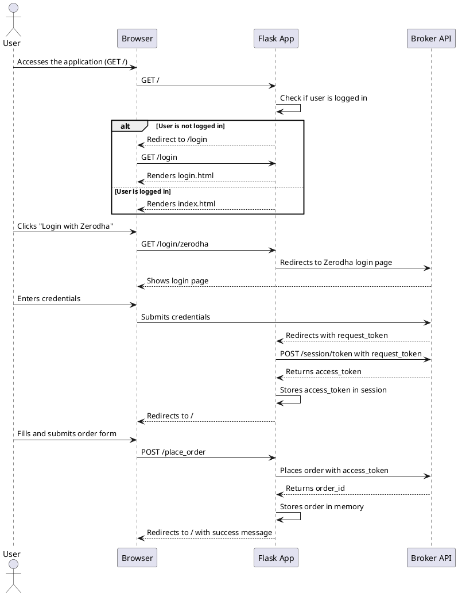
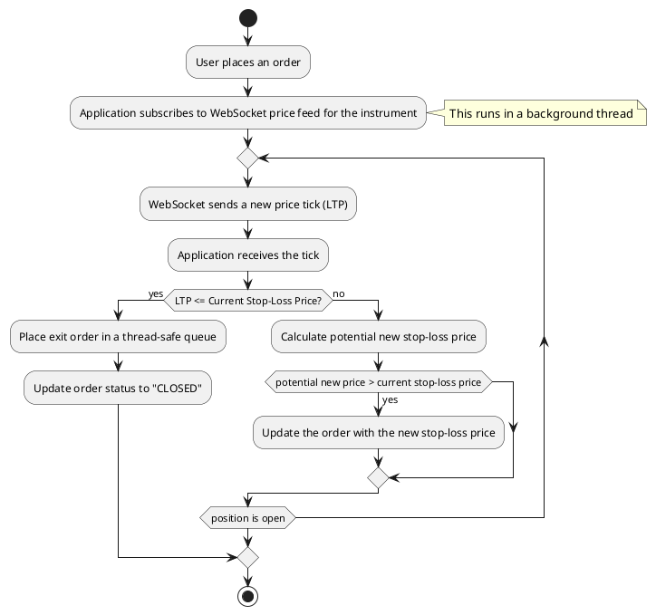

# Application Workflow Diagrams

This document contains UML diagrams that illustrate the workflow of the trading tool application. The diagrams are created using PlantUML.

## 1. Login and Order Placement Sequence Diagram

This diagram shows the sequence of interactions between the user, the browser, the Flask application, and the broker APIs for logging in and placing an order.

## 2. Trailing Stop-Loss Activity Diagram

This diagram illustrates the logic of the trailing stop-loss mechanism.

